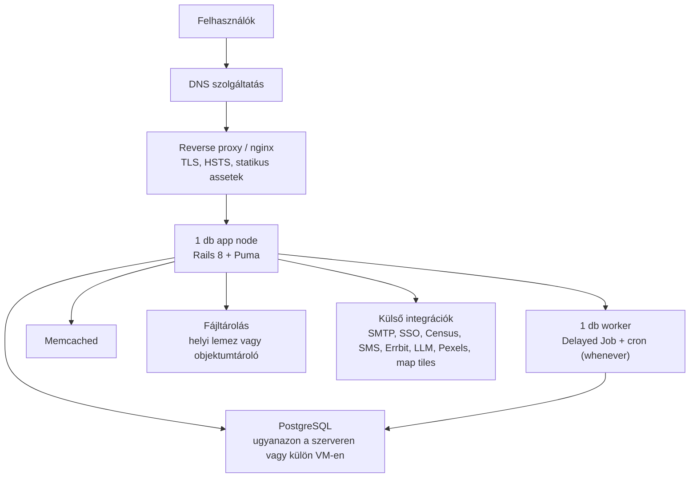

# CONSUL DEMOCRACY — Architektúra keretek telepítéshez és üzemeltetéshez

## 1. Áttekintés

A CONSUL DEMOCRACY egy Ruby on Rails 8 monolit e-részvételi platform (javaslatok, szavazások, költségvetés-tervezés, fórum stb.), PostgreSQL adatbázissal.

2 alapvető architektúra-döntés van az elején:

- **Egy szervezet / egy tenant** vs. **multi-tenant** (a beépített `ros-apartment` gem PostgreSQL séma-alapú izolációt biztosít, host/aldomain alapú útválasztással) — ha több önkormányzat/szervezet fogja ugyanazt a telepítést használni saját doménnel, ezt már a kezdetektől be kell tervezni, mert visszamenőleg átalakítani költséges.
- **Van-e létező önkormányzati háttérrendszer** (választópolgár-nyilvántartás/lakcím-ellenőrzés, SMS gateway), amit integrálni kell, vagy ezeket ki kell kapcsolni/helyettesíteni.

## 2. Magas szintű architektúra

```
                         ┌─────────────────────┐
                         │   Reverse proxy /    │  TLS terminálás, statikus
                         │   nginx (nem Rails)  │  asset kiszolgálás, HSTS
                         └──────────┬───────────┘
                                    │
                     ┌──────────────┼──────────────┐
                     ▼              ▼              ▼
              ┌───────────┐  ┌───────────┐  ┌───────────┐
              │ App node  │  │ App node  │  │ ...       │   Puma, több node
              │ (Puma)    │  │ (Puma)    │  │           │   load balancer mögött
              └─────┬─────┘  └─────┬─────┘  └─────┬─────┘
                     │              │              │
        ┌────────────┼──────────────┼──────────────┘
        ▼            ▼              ▼
  ┌───────────┐ ┌───────────┐ ┌──────────────────┐
  │ PostgreSQL│ │ Memcached │ │ Delayed Job       │  cron: sitemap, hot-score,
  │ (primary +│ │ (Dalli,   │ │ worker node(ok)   │  cache-cleanup (whenever)
  │  backup)  │ │ cache)    │ │ (DB-alapú queue)  │
  └───────────┘ └───────────┘ └──────────────────┘
        │
        ▼
  ┌─────────────────────────┐
  │ Fájltárolás (Active     │  local lemez VAGY S3 / GCS / Azure Blob
  │ Storage)                │
  └─────────────────────────┘

  Külső integrációk: SMTP, Errbit (hibakövetés), OAuth/SSO providerek,
  Census API (SOAP), SMS gateway, LLM providerek, Pexels, térkép tile szerver
```

### 2.1 Minimálisan javasolt production konfiguráció

Ez a legkisebb olyan éles felállás, ami már külön kezeli a webkiszolgálást, az alkalmazást, a háttérfolyamatokat és az adattárolást. Nem HA kialakítás, de üzemeltethető és jól bővíthető kiindulópont.



Minimál konfiguráció értelmezése:

- **1 db reverse proxy / nginx** a TLS termináláshoz és a statikus tartalom kiszolgálásához
- **1 db app node** Puma-val
- **1 db delayed_job worker + cron** ugyanazon a gépen vagy külön processzként/containerként
- **1 db PostgreSQL** példány rendszeres backup-pal
- **1 db Memcached** cache-hez
- **Fájltárolás**: egy node esetén lehet helyi lemez, de ha várható a későbbi skálázás, jobb rögtön objektumtárolóval indulni

Gyakorlati megjegyzés: költségminimalizálás esetén az nginx, az app, a worker, a cron, a PostgreSQL és a Memcached akár **egy erősebb szerveren** is elférnek induláskor, de logikailag akkor is külön komponensként kell rájuk tervezni, mert a későbbi szétválasztás várható.

## 3. Környezetek

A `config/secrets.yml.example` öt környezetet különböztet meg: `development`, `test`, `staging`, `preproduction`, `production`.

Javasolt gyakorlat:

| Környezet | Cél | Megjegyzés |
|---|---|---|
| development | helyi fejlesztés | Docker Compose vagy natív install |
| test | CI (GitHub Actions `tests.yml` és GitLab CI is konfigurálva van a repóban) | automatikus teszt futtatás minden PR-en |
| staging | belső QA, demózás | HTTP Basic Auth-hal védve alapból |
| preproduction | ügyfél/megrendelő UAT | production-közeli adatokkal, de elkülönítve |
| production | éles rendszer | force_ssl, valós SMTP/Census/SMS integrációk |

CI/CD: a meglévő GitHub Actions workflow-ra érdemes ráépíteni automatikus deploy lépést (pl. Capistrano vagy az installer hívása) staging/production ágakra.

## 4. Kompute és skálázás

A projekt hivatalos ajánlása (`docs/en/installation/servers.md`):

- **Production**: min. 32 GB RAM, 4 mag, Ubuntu 22.04/24.04 vagy Debian Bullseye/Bookworm/Trixie
- **Staging**: min. 16 GB RAM, 2 mag
- 1 millió lakos feletti település esetén: **külön DB szerver** + **2-3 app szerver** load balancer mögött

Skálázási irány: az app rétegben stateless Puma node-ok horizontálisan skálázhatók a load balancer mögött; a szűk keresztmetszet jellemzően a PostgreSQL és a delayed_job worker-ek. A delayed_job workerek számát Capistrano-config (`delayed_job_workers`) és a `whenever` cron reboot-parancsa (`bin/delayed_job -m -n 2 restart`) tartja szinkronban — ezt skálázáskor **mindkét helyen** módosítani kell.

## 5. Adattárolás és állapot

- **PostgreSQL** (≥13): elsődleges adattár, migrációk `db:migrate`-tel. Kell: rendszeres backup (pl. `pg_dump`/WAL archiválás), lehetőleg PITR (point-in-time recovery) terv, replikáció HA esetén.
- **Memcached**: cache réteg (`Dalli`), a névtér tenant-enkénti (`Tenant.current_schema`) — multi-tenant esetben ez már be van drótozva. **Nem** session store, csak fragment/query cache.
- **Fájltárolás (Active Storage)**: alapértelmezés helyi lemez (`TenantDisk`), ami egy node esetén elég, de **több app node esetén megosztott/objektum-tárolás szükséges** (S3, GCS vagy Azure Blob — mindhárom elő van készítve `config/storage.yml`-ben, kikommentezve; S3-hoz külön gemet kell hozzáadni a `Gemfile_custom`-hoz, lásd `docs/en/installation/using-aws-s3-as-storage.md`).
- **Multi-tenancy**: ha igen, minden migrációt tenant-enkénti sémákra is le kell futtatni (apartment gem kezeli), és a backup/restore stratégiát is séma-szinten kell tervezni.

## 6. Háttérfolyamatok és ütemezés

`delayed_job_active_record` + `whenever` cron:

- naponta 05:00 — sitemap frissítés
- naponta 01:00 — régi cache-elt mellékletek törlése
- naponta 03:00 — szavazatok "hot score" újraszámítása
- reboot — delayed_job worker(ek) újraindítása

Ezeket a cron bejegyzéseket a `whenever` gem generálja crontab-bá deploykor — üzemeltetéskor ellenőrizni kell, hogy a crontab valóban frissül minden deploy után.

## 7. Biztonság

- `force_ssl` + HSTS bekapcsolása production/staging/preprod secrets-ben
- `devise-security`: jelszó-komplexitás, fiókzárolás (`lockable`, próbálkozás-limit), `last_sign_in` naplózás — mindegyik `secrets.yml` `security:` blokkban konfigurálható
- **Admin IP allowlist** (`security.allowed_admin_ips`) — érdemes élesben bekapcsolni az admin felülethez
- HTTP Basic Auth staging/preprod védelemhez (ne szivárogjon ki nem publikus tartalom)
- `invisible_captcha`: self-hosted honeypot-alapú captcha, **nincs külső API-függősége** (nem Google reCAPTCHA) — nincs teendő, de érdemes tudni, hogy ez nem helyettesíti a reCAPTCHA-t komolyabb bot-védelemre
- Content Security Policy initializer már be van állítva — külső integráció hozzáadásakor (pl. térkép tile szerver, embed-ek) ezt bővíteni kell
- **Titokkezelés**: `config/secrets.yml` és `config/database.yml` **soha nem kerülhet verziókezelésbe** (csak a `.example` fájlok vannak commitolva) — production titkokat env változóból vagy secret store-ból (Vault, AWS Secrets Manager stb.) érdemes befűzni, ne plain textben a szerveren

## 8. Integrációk — mit kell mérlegelni és beszerezni

| Integráció | Kötelező? | Megvalósítás | Mit kell beszerezni |
|---|---|---|---|
| **SMTP levelezés** | Igen | `action_mailer` + `secrets.yml smtp_settings` | SMTP fiók (tranzakciós email szolgáltató ajánlott: pl. dedikált SMTP relay), SPF/DKIM/DMARC beállítás a doménen |
| **Hibakövetés (Errbit/Airbrake)** | Erősen ajánlott | `airbrake` gem, self-hosted Errbit-kompatibilis backend felé | Errbit szerver (saját üzemeltetésű) vagy kompatibilis SaaS + `errbit_host`/`project_key`/`project_id` |
| **SSO / közösségi bejelentkezés** (Facebook, Google, Twitter, WordPress OAuth2, SAML, generikus OIDC) | Opcionális, üzleti döntés | `omniauth-*` gemek | Regisztrált app/client ID+secret az adott providernél; SAML esetén IdP metadata URL és tanúsítványok |
| **Census / választópolgár-ellenőrző rendszer** | Erősen projekt-specifikus | `app/lib/census_api.rb`, SOAP (`savon` gem) | Önkormányzati/állami háttérrendszer SOAP végpontja, hitelesítő adatok (`census_api_end_point`, `institution_code`, `portal_name`, `user_code`). **Ha nincs ilyen rendszer**, ezt a funkciót ki kell kapcsolni vagy egyedi (mock/saját) implementációt kell írni — ez tipikusan a legnagyobb egyedi fejlesztési igényű integráció |
| **SMS gateway** | Opcionális (hitelesítő kód küldéshez) | `app/lib/sms_api.rb` | SMS szolgáltató végpont + felhasználó/jelszó (`sms_end_point`, `sms_username`, `sms_password`) |
| **Fájltárolás (S3/GCS/Azure)** | Ajánlott több node esetén | Active Storage service | Cloud storage bucket/account, hozzáférési kulcsok, IAM jogosultság csak az adott bucket-re |
| **Térkép tile szolgáltatás** | Igen (alapértelmezett OSM) | `maps.map_tiles_provider` | Alapból ingyenes OpenStreetMap tile szerver — nagy forgalomnál mérlegelendő fizetős tile provider (rate limit elkerülése) |
| **AI/LLM funkciók** | Opcionális | `ruby_llm` gem (DeepSeek, Vertex AI, stb.) | API kulcs vagy GCP service account (`google_application_credentials`) — **adatvédelmi/GDPR mérlegelést igényel**, ha aktiválva van (felhasználói tartalom külső LLM-hez kerül) |
| **Pexels (stock kép kereső)** | Opcionális | `pexels` gem | Pexels API access key |
| **Gépi fordítás (Bing Translator)** | Opcionális | `bing_translator` gem, Microsoft API kulcs | Azure/Microsoft Translator API kulcs |
| **GraphQL API** | Beépített, nyilvánosan elérhető | `graphql` + `graphiql-rails` | Ha külső kliensek fogják hívni, érdemes mérlegelni rate limitet/auth réteget elé, és a `graphiql` UI-t production-ben letiltani vagy védeni |
| **"Managers" külső API** | Opcionális, ismeretlen célú a jelenlegi konfigból | `managers_url`/`managers_application_key` | Tisztázandó az ügyféllel, mire szolgál a konkrét telepítésben |

## 9. Deployment folyamat

Ajánlott sorrend:

1. **Elsődleges út**: a hivatalos, különálló [`consuldemocracy/installer`](https://github.com/consuldemocracy/installer) repó használata — ez automatizálja a szerver-előkészítést és a Capistrano-alapú deployt, ezt tartja karban a projekt közössége.
2. **Alternatíva**: kézi Capistrano deploy (`Capfile`, `config/deploy.rb` már a repóban van) — `cap production deploy`, amihez SSH deploy user, Ruby/Node verziókezelés (rvm/rbenv + node-build) és a szerver-oldali gemek (capistrano-puma, capistrano3-delayed-job) szükségesek.
3. **Konténerizált production**, ha ez a preferált irány: a jelenlegi `Dockerfile`/`docker-compose.yml` **csak fejlesztői**, élesben külön kellene: nginx (reverse proxy + statikus asset), külön worker container (delayed_job), külön cron container/sidecar, TLS terminálás, és a `config.public_file_server.enabled` env változó beállítása, ha mégis a Rails szolgálná ki a statikus fájlokat.

## 10. Monitorozás és naplózás

- `RAILS_LOG_TO_STDOUT` env változóval STDOUT-ra logolás konténeres/orkesztrált környezetben; alapból napi log-rotáció fájlba
- `/up` health-check endpoint már be van kötve (health check monitorozáshoz, silence-elt a logban)
- Errbit hibakövetés (lásd fent)
- **Kiegészítendő** (nincs beépítve): uptime/külső monitoring (pl. Pingdom/UptimeRobot jellegű), APM/teljesítmény-monitoring, DB-metrikák (pl. pg_stat alapú dashboard), log-aggregáció (ELK/Loki), riasztás (alerting) kritikus hibákra és lemezterület-kifogyásra

## 11. Nyitott döntési pontok az ügyfél/megrendelő felé

Ezeket érdemes tisztázni, mielőtt a részletes megvalósítási terv/költségbecslés elkészül:

1. **Multi-tenant** kell-e (több szervezet/település egy telepítésen), vagy egy szervezetnek épül a rendszer?
2. Van-e **létező választópolgár-nyilvántartó/census rendszer**, amit integrálni kell, vagy ez a funkció kikapcsolható/egyszerűsíthető?
3. Melyik **SSO/közösségi bejelentkezési** módok szükségesek ténylegesen (Google, Facebook, Twitter, SAML a meglévő céges IdP-hez, OIDC)?
4. **SMS-alapú hitelesítés** kell-e, és ha igen, melyik SMS szolgáltatóhoz kell csatlakozni?
5. **Fájltárolás**: helyi lemez elég-e (egy node), vagy S3/GCS/Azure szükséges (több node, HA)?
6. Kell-e az **AI/LLM funkció** — ha igen, melyik provider és milyen adatvédelmi keretek mellett (GDPR-releváns, mivel felhasználói tartalom kerülhet külső szolgáltatóhoz)?
7. Van-e elvárás **rendelkezésre állásra** (SLA, HA, disaster recovery), ami befolyásolja a DB-replikáció és a load balancing tervét?
