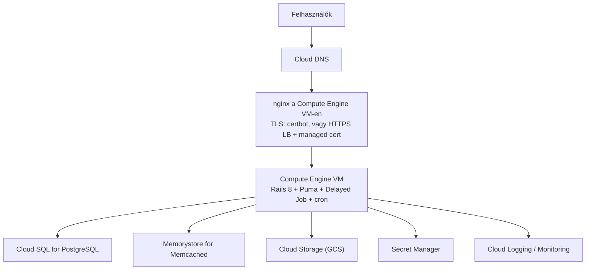
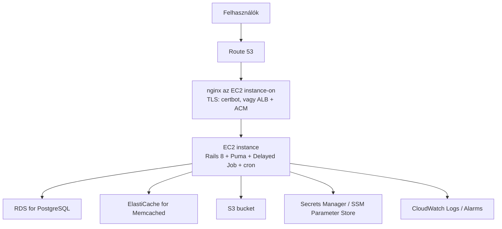

# CONSUL DEMOCRACY — Minimális architektúra megvalósítása Google Cloud és AWS infrastruktúrán

Ez a dokumentum az "Architektúra lehetőségek" c. leírás 2.1 pontjában meghatározott **minimális production architektúrát** foglalja össze, majd bemutat hozzá egy-egy lehetséges konkrét megvalósítást Google Cloud Platform (GCP) és Amazon Web Services (AWS) infrastruktúrán.

## 1. A minimális architektúra összefoglalása

A legkisebb olyan éles felállás, ami már külön kezeli a webkiszolgálást, az alkalmazást, a háttérfolyamatokat és az adattárolást:

- **1 reverse proxy / nginx** — TLS terminálás, statikus assetek kiszolgálása
- **1 app node** — Rails 8 + Puma
- **1 worker** — Delayed Job + cron (`whenever`)
- **1 PostgreSQL** példány — rendszeres backuppal
- **1 Memcached** — cache réteg (Dalli)
- **Fájltárolás** — helyi lemez vagy objektumtároló (Active Storage)

Költségminimalizálás esetén ezek a komponensek egy erősebb szerveren is elférnek, de logikailag külön komponensként érdemes rájuk tervezni a későbbi szétválasztás miatt. Hivatalos production ajánlás: min. 32 GB RAM, 4 mag.

## 2. Megvalósítás Google Cloud Platform-on

| Minimális komponens | GCP szolgáltatás |
|---|---|
| Reverse proxy / TLS | nginx a VM-en + Let's Encrypt (certbot) — induláskor; skálázáskor HTTPS Load Balancer + Google-managed cert |
| App node (Puma) | Compute Engine VM — pl. `e2-standard-4` (4 vCPU / 16 GB), a hivatalos ajánláshoz `e2-standard-8` (8 vCPU / 32 GB) |
| Delayed Job worker + cron | ugyanazon a VM-en külön processzként, `whenever` generálja a crontabot |
| PostgreSQL | **Cloud SQL for PostgreSQL** — managed, automatikus backup + PITR |
| Memcached | **Memorystore for Memcached**, vagy induláskor helyi memcached a VM-en |
| Fájltárolás | **Cloud Storage (GCS)** bucket — a `gcs` service már elő van készítve `config/storage.yml`-ben |
| DNS | Cloud DNS |
| Titokkezelés | Secret Manager (env változóként befűzve `secrets.yml`/`database.yml` helyett) |
| Naplózás / monitoring | Cloud Logging (`RAILS_LOG_TO_STDOUT`) + Cloud Monitoring uptime check a `/up` endpointra |
| Hálózat / védelem | VPC firewall: csak 80/443 nyitva kifelé; SSH IAP-on keresztül, nyilvános SSH port nélkül |

Megjegyzések:

- A minimális éles felállás egyetlen Compute Engine VM-mel indulhat (nginx + app + worker + cron egy gépen), a PostgreSQL viszont már induláskor érdemes managed szolgáltatásként (Cloud SQL) futnia — a backup/PITR ott gyakorlatilag "beépített", míg self-managed Postgres esetén ezt külön kellene megoldani.
- Ha az `ruby_llm` gemen keresztül LLM funkció aktív és Vertex AI-t használnak, ez egyben egy natív GCP-integráció is (`google_application_credentials` service account).
- Későbbi skálázási irány (több app node, HA): a VM-et image/instance template mögé lehet tenni Managed Instance Group + HTTPS Load Balancer formájában, konténerizált irányban pedig Cloud Run/GKE — ezek már túlmutatnak a minimális architektúrán.

## 3. Megvalósítás Amazon Web Services-en

| Minimális komponens | AWS szolgáltatás |
|---|---|
| Reverse proxy / TLS | nginx az EC2 instance-on + certbot — induláskor; skálázáskor Application Load Balancer + ACM tanúsítvány |
| App node (Puma) | EC2 instance — pl. `t3.xlarge` (4 vCPU / 16 GB), a hivatalos ajánláshoz `m5.2xlarge` (8 vCPU / 32 GB) |
| Delayed Job worker + cron | ugyanazon EC2 instance-on külön processzként |
| PostgreSQL | **RDS for PostgreSQL** — managed, automatikus backup + PITR |
| Memcached | **ElastiCache for Memcached**, vagy induláskor helyi memcached az instance-on |
| Fájltárolás | **S3** bucket — Active Storage `amazon` service, ehhez az `aws-sdk-s3` gemet fel kell venni a `Gemfile_custom`-ba (lásd `docs/en/installation/using-aws-s3-as-storage.md`) |
| DNS | Route 53 |
| Titokkezelés | Secrets Manager vagy SSM Parameter Store |
| Naplózás / monitoring | CloudWatch Logs (`RAILS_LOG_TO_STDOUT`) + CloudWatch alarm / Route 53 health check a `/up` endpointra |
| Hálózat / védelem | Security Group: csak 80/443 nyitva kifelé; SSH helyett Session Manager (SSM), nyilvános SSH port nélkül |

Megjegyzések:

- Ugyanaz az elv, mint GCP-nél: az app/worker réteg indulhat egyetlen EC2 instance-ról, de az RDS-t érdemes már a minimális felállásban is bevonni a manuális backup-kezelés kiváltására.
- A Consul Democracy dokumentációja külön leírja az S3-as fájltárolás bekötését (`using-aws-s3-as-storage.md`) — ez a legkészebb integráció a három objektumtároló-opció közül.
- Deploy: a projekt hivatalos `installer` repója és a Capistrano-alapú deploy változtatás nélkül SSH-n keresztül működik EC2-re; konténerizált irányban ECS/Fargate + RDS + S3 lenne a későbbi skálázási út.

## 4. Gyors összevetés

| Szempont | GCP | AWS |
|---|---|---|
| Managed PostgreSQL | Cloud SQL | RDS |
| Managed Memcached | Memorystore | ElastiCache |
| Objektumtárolás | Cloud Storage (előkészítve) | S3 (előkészítve, dokumentált) |
| Titokkezelés | Secret Manager | Secrets Manager / SSM Parameter Store |
| SSH nélküli szerver-hozzáférés | Identity-Aware Proxy (IAP) | Session Manager (SSM) |

A választás jellemzően nem technikai kényszer kérdése — mindkét felhő lefedi a minimális architektúra összes komponensét egyenértékű managed szolgáltatással. Gyakorlati döntési szempont inkább: van-e már meglévő GCP/AWS szerződés vagy kredit, illetve melyik platformon van üzemeltetési tapasztalat a csapatban.
